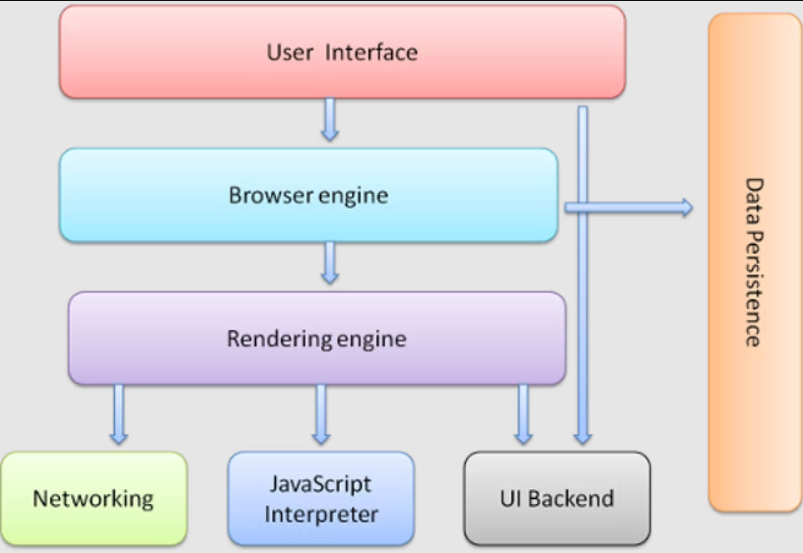

# Assignment 1
When a user enters an URL in the browser, how does the browser fetch the desired result

## Populating the Page

Users want web experiences with content that is fast to load and smooth to interact with. Fast sites provide better user experiences. Users want and expect web experiences with content that is fast to load and smooth to interact with.

Two major issues in web performance are understanding issues having to do with latency and issues having to do with the fact that for the most part, browsers are single threaded.

Latency is our main threat to overcome to ensure a fast load. To be fast to load, the developers' goals include sending requested information as fast as possible, or at least seem super fast. Network latency is the time it takes to transmit bytes over-the-air to computers. Web performance is what we have to do to make the page load happen as quickly as possible.

For the most part, browsers are considered single threaded. For smooth interactions, the developer's goal is to ensure performant site interactions, from smooth scrolling to being responsive to touch. Render time is key, with ensuring the main thread can complete all the work we throw at it and still always be available to handle user interactions. Web performance can be improved by understanding the single-threaded nature of the browser and minimizing the main thread's responsibilities, where possible and appropriate, to ensure rendering is smooth and responses to interactions are immediate.

## Navigation

Navigation is the first step in loading a web page. It occurs whenever a user requests a page by entering a URL into the address bar, clicking a link, submitting a form, as well as other actions.

One of the goals of web performance is to minimize the amount of time a navigation takes to complete. In ideal conditions, this usually doesn't take too long, but latency and bandwidth are foes which can cause delays.

# DNS Lookup
Your browser requests a DNS lookup, which is eventually fielded by a name server, which in turn responds with an IP address. After this initial request, the IP will likely be cached for a time, which speeds up subsequent requests by retrieving the IP address from the cache instead of contacting a name server again.

DNS lookups usually only need to be done once per hostname for a page load. However, DNS lookups must be done for each unique hostname the requested page references. If your fonts, images, scripts, ads, and metrics all have different hostnames, a DNS lookup will have to be made for each one.

# TCP Handshake
Once the IP address is known, the browser sets up a connection to the server via a TCP three-way handshake. This mechanism is designed so that two entities attempting to communicate—in this case the browser and web server—can negotiate the parameters of the network TCP socket connection before transmitting data, often over HTTPS.

TCP's three way handshaking technique is often referred to as "SYN-SYN-ACK"—or more accurately SYN, SYN-ACK, ACK—because there are three messages transmitted by TCP to negotiate and start a TCP session between two computers. Yes, this means three more messages back and forth between each server, and the request has yet to be made.

While making the connection secure adds time to the page load, a secure connection is worth the latency expense, as the data transmitted between the browser and the web server cannot be decrypted by a third party.

After the 8 round trips, the browser is finally able to make the request.

# TLS Negotiation
For secure connections established over HTTPS, another "handshake" is required. This handshake, or rather the TLS negotiation, determines which cipher will be used to encrypt the communication, verifies the server, and establishes that a secure connection is in place before beginning the actual transfer of data. This requires three more round trips to the server before the request for content is actually sent.

## The browser's main functionality 
The main function of a browser is to present the web resource you choose, by requesting it from the server and displaying it in the browser window. The resource is usually an HTML document, but may also be a PDF, image, or some other type of content. The location of the resource is specified by the user using a URI (Uniform Resource Identifier).

The way the browser interprets and displays HTML files is specified in the HTML and CSS specifications. These specifications are maintained by the W3C (World Wide Web Consortium) organization, which is the standards organization for the web. For years browsers conformed to only a part of the specifications and developed their own extensions. That caused serious compatibility issues for web authors. Today most of the browsers more or less conform to the specifications.

Browser user interfaces have a lot in common with each other. Among the common user interface elements are:

1. Address bar for inserting a URI
2. Back and forward buttons
3. Bookmarking options
4. Refresh and stop buttons for refreshing or stopping the loading of current documents
5. Home button that takes you to your home page

The HTML5 specification doesn't define UI elements a browser must have, but lists some common elements. Among those are the address bar, status bar and tool bar. There are, of course, features unique to a specific browser like Firefox's downloads manager.

## The browser's high level structure
The browser's main components are:

1. **The user interface:** this includes the address bar, back/forward button, bookmarking menu, etc. Every part of the browser display except the window where you see the requested page.
2. **The browser engine:** marshals actions between the UI and the rendering engine.
3. **The rendering engine:** responsible for displaying requested content. For example if the requested content is HTML, the rendering engine parses HTML and CSS, and displays the parsed content on the screen.
4. **Networking:** for network calls such as HTTP requests, using different implementations for different platform behind a platform-independent interface.
5. **UI backend:** used for drawing basic widgets like combo boxes and windows. This backend exposes a generic interface that is not platform specific. Underneath it uses operating system user interface methods.
6. **JavaScript interpreter:** Used to parse and execute JavaScript code.
7. **Data storage:** This is a persistence layer. The browser may need to save all sorts of data locally, such as cookies. Browsers also support storage mechanisms such as localStorage, IndexedDB, WebSQL and FileSystem.

It is important to note that browsers such as Chrome run multiple instances of the rendering engine: one for each tab. Each tab runs in a separate process.

## The rendering engine

The responsibility of the rendering engine is to display the requested contents on the browser screen.

## Rendering engines

Different browsers use different rendering engines: Internet Explorer uses Trident, Firefox uses Gecko, Safari uses WebKit. Chrome and Opera (from version 15) use Blink, a fork of WebKit.

WebKit is an open source rendering engine which started as an engine for the Linux platform and was modified by Apple to support Mac and Windows. See webkit.org for more details.

## The main flow

The rendering engine will start getting the contents of the requested document from the networking layer. This will usually be done in 8kB chunks.

After that, this is the basic flow of the rendering engine:

The rendering engine will start parsing the HTML document and convert elements to DOM nodes in a tree called the "content tree". The engine will parse the style data, both in external CSS files and in style elements. Styling information together with visual instructions in the HTML will be used to create another tree: the render tree.

The render tree contains rectangles with visual attributes like color and dimensions. The rectangles are in the right order to be displayed on the screen.

After the construction of the render tree it goes through a "layout" process. This means giving each node the exact coordinates where it should appear on the screen. The next stage is painting - the render tree will be traversed and each node will be painted using the UI backend layer.

It's important to understand that this is a gradual process. For better user experience, the rendering engine will try to display contents on the screen as soon as possible. It will not wait until all HTML is parsed before starting to build and layout the render tree. Parts of the content will be parsed and displayed, while the process continues with the rest of the contents that keeps coming from the network.

Webkit Main flow Example:

WebKit uses the term "Render Tree" and it consists of "Render Objects". WebKit uses the term "layout" for the placing of elements, "Attachment" is WebKit's term for connecting DOM nodes and visual information to create the render tree. 